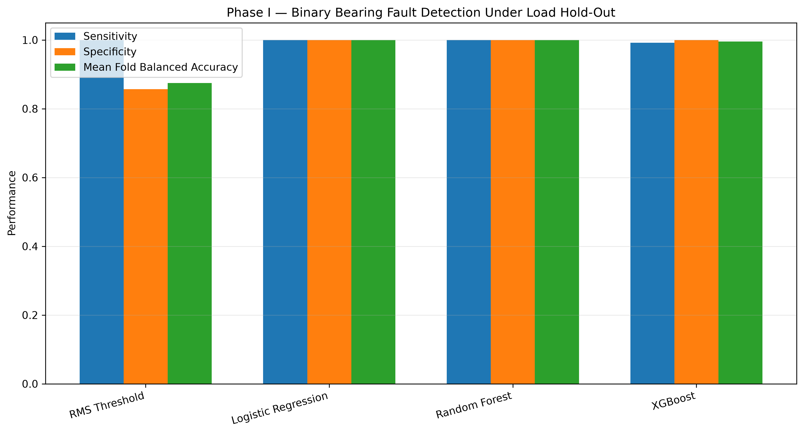
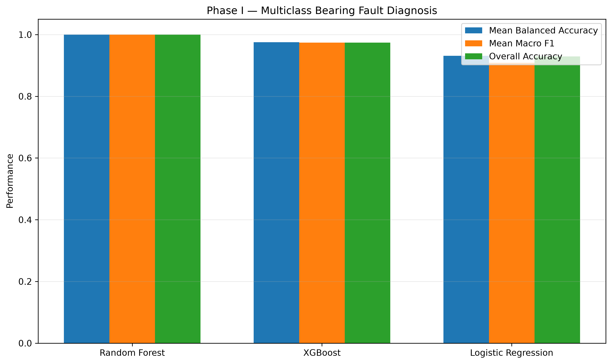
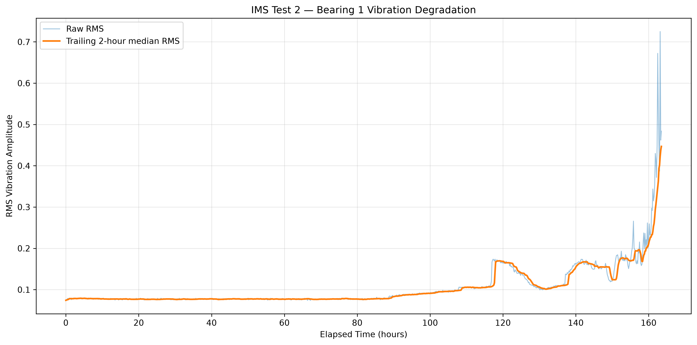
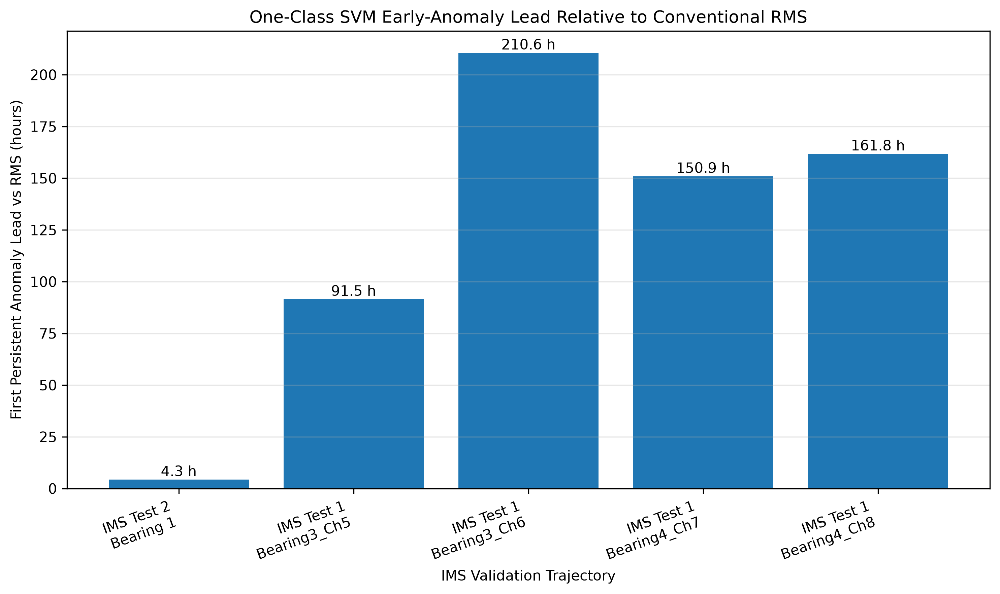

<div align="center">

# AI Predictive Maintenance for Rolling-Element Bearings

**Machine learning-based vibration fault detection and early anomaly warning under variable operating conditions**

<p>
  <a href="notebooks/01_cwru_fault_detection.ipynb"></a>
  <a href="notebooks/02_ims_early_warning.ipynb"></a>
  <a href="results/FINAL_master_results.csv"></a>
</p>

<p>
  
  
  
  
  
</p>

<p>
  <a href="#key-results">Key results</a> ·
  <a href="#visual-results">Figures</a> ·
  <a href="#methodology">Methodology</a> ·
  <a href="#results-and-code">Code & results</a> ·
  <a href="#datasets">Datasets</a>
</p>

</div>

---

## Overview

This research project evaluates whether multivariate machine-learning methods can improve bearing condition monitoring beyond conventional RMS vibration thresholds.

It combines two complementary engineering tasks:

| Phase | Dataset | Objective | Main approach |
|---|---|---|---|
| **I** | CWRU | Fault detection and fault-type diagnosis under load shift | Logistic Regression, Random Forest, XGBoost vs RMS threshold |
| **II** | NASA IMS | Detect persistent multivariate degradation before RMS escalation | One-Class SVM, Isolation Forest, LOF vs RMS |

The key question is not simply whether a model can classify faults, but whether it remains useful under **operating-condition shift** and whether multivariate signal changes can provide **earlier anomaly warning**.

---

## Key Results

### Phase I · CWRU load-transfer benchmark

| Method | Task | Mean Fold Balanced Accuracy | Overall Accuracy |
|---|---|---:|---:|
| RMS Threshold | Binary fault detection | 0.8750 | 0.9677 |
| Logistic Regression | Binary fault detection | **1.0000** | **1.0000** |
| Random Forest | Binary fault detection | **1.0000** | **1.0000** |
| XGBoost | Binary fault detection | 0.9958 | 0.9935 |
| Logistic Regression | Multiclass diagnosis | 0.9313 | 0.9290 |
| Random Forest | Multiclass diagnosis | **1.0000** | **1.0000** |
| XGBoost | Multiclass diagnosis | 0.9750 | 0.9742 |

> **Main finding:** the fixed RMS baseline detected every fault window but produced false alarms under the held-out 0 HP healthy condition. Multivariate ML was more robust on this selected benchmark.

### Phase II · NASA IMS early-anomaly analysis

Using a 24-hour healthy baseline, baseline-only RobustScaler fitting, a One-Class SVM, a 99th-percentile baseline anomaly threshold, and a three-consecutive-exceedance persistence rule:

| Dataset / trajectory | RMS alarm | SVM alarm | Anomaly lead vs RMS |
|---|---:|---:|---:|
| IMS Test 2 — Bearing 1 | 89.00 h | 84.67 h | **+4.33 h** |
| IMS Test 1 — Bearing 3 Ch. 5 | 135.96 h | 44.43 h | **+91.53 h** |
| IMS Test 1 — Bearing 3 Ch. 6 | 243.18 h | 32.60 h | **+210.58 h** |
| IMS Test 1 — Bearing 4 Ch. 7 | 180.52 h | 29.60 h | **+150.92 h** |
| IMS Test 1 — Bearing 4 Ch. 8 | 242.51 h | 80.72 h | **+161.79 h** |

> These values are **apparent early-anomaly leads relative to the RMS alarm**, not remaining-useful-life predictions or proof that physical failure was predictable at those exact times.

A Test 2 sensitivity study evaluated 12 calibration configurations per model. One-Class SVM alarmed earlier than RMS in **9/12** configurations and at the same time in **3/12**, with lead times ranging from **0 to 61.33 hours**.

---

## Visual Results

<table>
  <tr>
    <td width="50%">
      
    </td>
    <td width="50%">
      
    </td>
  </tr>
  <tr>
    <td align="center"><strong>Phase I · Binary fault detection</strong></td>
    <td align="center"><strong>Phase I · Multiclass diagnosis</strong></td>
  </tr>
</table>

<p align="center">
  
</p>
<p align="center"><strong>Phase II · Early-anomaly lead relative to RMS</strong></p>

<details>
<summary><strong>Explore additional figures</strong></summary>

<br>

<table>
  <tr>
    <td></td>
    <td></td>
  </tr>
  <tr>
    <td></td>
    <td></td>
  </tr>
</table>

</details>

---

## Methodology

### Signal processing and feature engineering

Each one-second vibration window is represented using:

- RMS
- Standard deviation
- Peak amplitude
- Peak-to-peak amplitude
- Skewness
- Kurtosis
- Crest factor

For the selected CWRU subset, normal recordings acquired at 48 kHz are resampled to 12 kHz to match the native 12 kHz fault recordings before feature extraction.

### Leakage-aware validation

**Phase I** uses **leave-one-load-out (LOLO)** validation: models train on three motor-load conditions and evaluate on the fourth. Thresholds and preprocessing parameters are estimated from training data only.

**Phase II** preserves chronology. Scaling and alarm calibration use only the designated healthy baseline, while persistent alarms require three consecutive threshold exceedances.

### Models evaluated

| Supervised classification | Unsupervised anomaly detection |
|---|---|
| Logistic Regression | One-Class SVM |
| Random Forest | Isolation Forest |
| XGBoost | Local Outlier Factor |

---

## Project Structure

```text
AI-Predictive-Maintenance/
├── README.md
├── requirements.txt
├── .gitignore
├── data/
│   └── README.md
├── notebooks/
│   ├── 01_cwru_fault_detection.ipynb
│   └── 02_ims_early_warning.ipynb
├── results/
│   ├── FINAL_master_results.csv
│   ├── FINAL_key_findings.csv
│   ├── phase1_feature_dataset.csv
│   └── ...
└── figures/
    └── 9 analysis and publication figures
```

---

## Results and Code

| Resource | Description |
|---|---|
| [01 · CWRU fault detection](notebooks/01_cwru_fault_detection.ipynb) | Phase I feature engineering, classification and LOLO validation |
| [02 · IMS early warning](notebooks/02_ims_early_warning.ipynb) | Phase II IMS data setup and early-warning workflow |
| [Master results table](results/FINAL_master_results.csv) | Consolidated Phase I and Phase II metrics |
| [Key findings](results/FINAL_key_findings.csv) | Compact summary of headline findings |
| [Phase I feature dataset](results/phase1_feature_dataset.csv) | Engineered vibration-feature dataset |
| [Test 1 validation](results/phase2_test1_validation.csv) | Frozen-protocol IMS Test 1 results |
| [Test 2 sensitivity analysis](results/phase2_test2_sensitivity_full.csv) | Calibration sensitivity across models |

---

## Datasets

Raw datasets are intentionally **not committed** to this repository.

- **CWRU Bearing Data Center:** https://engineering.case.edu/bearingdatacenter/welcome
- **NASA IMS Bearings:** https://data.nasa.gov/dataset/ims-bearings

See [data/README.md](data/README.md) for the selected subset and preprocessing assumptions used in this project.

---

## Quick Start

```bash
git clone https://github.com/daksheshftw/AI-Predictive-Maintenance.git
cd AI-Predictive-Maintenance

python -m venv .venv
source .venv/bin/activate
pip install -r requirements.txt
```

Then download the source datasets from their official repositories and place them in the local data directories described in `data/README.md`.

> The CWRU notebook contains the cleaned Phase I analysis workflow. The available IMS notebook contains the cleaned Phase II data setup/discovery workflow; the exported Phase II experimental results and sensitivity analyses are preserved in the `results/` directory.

---

## Tech Stack

<p>
  
  
  
  
  
  
  
  
</p>

---

## Interpretation and Limitations

- CWRU uses seeded faults and is primarily a fault-detection/diagnosis benchmark; it does not establish natural degradation lead time.
- The selected Phase I dataset contains 155 windows from 16 recordings, so perfect scores should not be interpreted as universal real-world performance.
- CWRU may reuse the same physical seeded-fault bearing across different load conditions; LOLO therefore evaluates operating-condition transfer rather than fully independent-bearing generalization.
- Normal and fault recordings originate from different acquisition rates before resampling, which may introduce systematic cues.
- Phase II anomaly lead is measured relative to an RMS alarm, not against a known physical fault-onset timestamp.
- Test 2 sensitivity analysis shows that early-warning lead depends materially on calibration choices.
- Test 1 sensor trajectories are not four independent physical bearing failures.

---

## Research Takeaway

**Multivariate ML improved fault-detection robustness under the evaluated CWRU load shift, while One-Class SVM detected distributional changes before RMS escalation on the evaluated IMS trajectories under the reported settings.**

The results do **not** support the stronger claim that machine learning always predicts failure earlier. Early-warning lead depends on calibration, trajectory characteristics, and how an alarm is defined.

<div align="center">

### Author

**Dakshesh Das**

Mechanical Engineering · Machine Learning · Predictive Maintenance

</div>
