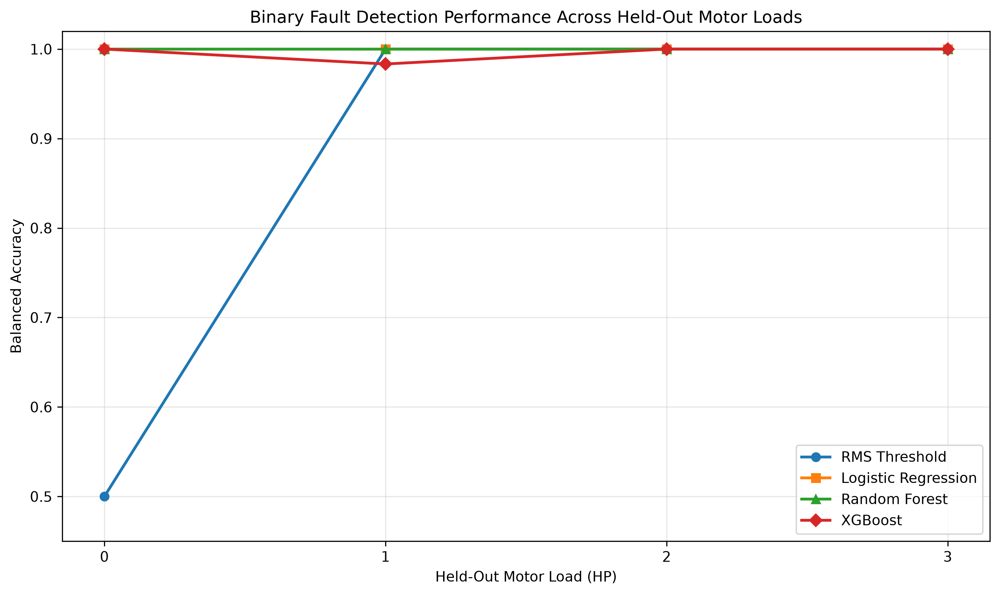
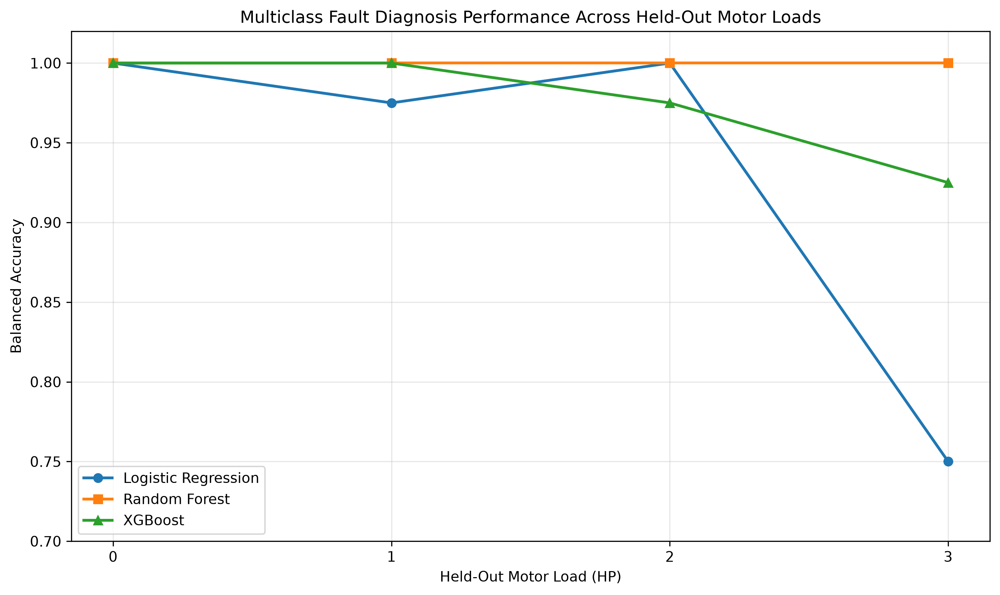
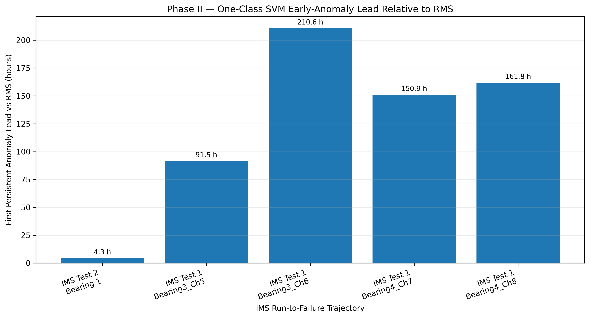

# AI Predictive Maintenance for Rolling-Element Bearings

**Machine learning-based vibration fault detection and early anomaly warning under variable operating conditions**

**Author:** Dakshesh Das

This project investigates whether multivariate machine-learning methods can improve bearing condition monitoring beyond conventional RMS vibration thresholds. It combines a seeded-fault benchmark with run-to-failure bearing data to evaluate both **fault-detection robustness** and **early anomaly warning**.

- **Phase I — CWRU:** Logistic Regression, Random Forest, and XGBoost are compared with conventional RMS thresholding using leave-one-load-out validation.
- **Phase II — NASA IMS:** persistent multivariate anomaly detection is compared with conventional RMS escalation on chronological run-to-failure trajectories.

The central engineering question is not simply whether a model can classify faults, but whether it remains useful under operating-condition shifts and whether multivariate changes can be detected before a conventional vibration threshold alarms.

## Key Results

### Phase I — CWRU load-transfer benchmark

| Method | Task | Mean Fold Balanced Accuracy | Overall Accuracy |
|---|---|---:|---:|
| RMS Threshold | Binary fault detection | 0.8750 | 0.9677 |
| Logistic Regression | Binary fault detection | 1.0000 | 1.0000 |
| Random Forest | Binary fault detection | 1.0000 | 1.0000 |
| XGBoost | Binary fault detection | 0.9958 | 0.9935 |
| Logistic Regression | Multiclass diagnosis | 0.9313 | 0.9290 |
| Random Forest | Multiclass diagnosis | 1.0000 | 1.0000 |
| XGBoost | Multiclass diagnosis | 0.9750 | 0.9742 |

The fixed RMS baseline detected all fault windows but generated false alarms when the held-out 0 HP healthy condition shifted above the threshold learned from the other loads. Multivariate models were more robust on this selected benchmark.

### Phase II — NASA IMS early-anomaly analysis

Using a 24-hour healthy baseline, RobustScaler fitted only on baseline data, a One-Class SVM, a 99th-percentile baseline anomaly-score threshold, and a three-consecutive-exceedance persistence rule:

| Dataset / trajectory | RMS alarm | SVM alarm | Anomaly lead vs RMS |
|---|---:|---:|---:|
| IMS Test 2 — Bearing 1 | 89.00 h | 84.67 h | **+4.33 h** |
| IMS Test 1 — Bearing 3 Ch. 5 | 135.96 h | 44.43 h | **+91.53 h** |
| IMS Test 1 — Bearing 3 Ch. 6 | 243.18 h | 32.60 h | **+210.58 h** |
| IMS Test 1 — Bearing 4 Ch. 7 | 180.52 h | 29.60 h | **+150.92 h** |
| IMS Test 1 — Bearing 4 Ch. 8 | 242.51 h | 80.72 h | **+161.79 h** |

These are **apparent early-anomaly leads relative to the RMS alarm**, not remaining-useful-life predictions or proof that physical failure was predictable at those exact times. Test 1 contains four sensor trajectories from two failed physical bearings.

A Test 2 sensitivity study varied healthy-baseline duration and anomaly-score quantile across 12 configurations per model. One-Class SVM alarmed earlier than RMS in 9/12 configurations and at the same time in 3/12, with lead times ranging from 0 to 61.33 hours. This demonstrates that early-warning conclusions are calibration-sensitive.

## Visual Results

### Binary fault detection across held-out loads



### Multiclass diagnosis across held-out loads



### Phase II early-anomaly lead relative to RMS



Additional degradation plots and model-comparison figures are available in the [figures](figures/) directory.

## Methodology

### Signal processing and feature engineering

One-second vibration windows were represented using:

- RMS
- Standard deviation
- Peak amplitude
- Peak-to-peak amplitude
- Skewness
- Kurtosis
- Crest factor

For the selected CWRU subset, normal recordings acquired at 48 kHz were resampled to 12 kHz to match the native 12 kHz fault recordings before feature extraction.

### Leakage-aware validation

Phase I uses **leave-one-load-out (LOLO)** evaluation: models are trained on three motor-load conditions and evaluated on the fourth. Thresholds and preprocessing parameters are estimated from training data only.

Phase II preserves chronology. Scaling and alarm calibration use the designated healthy baseline only, and persistent alarms require three consecutive threshold exceedances.

## Repository Structure

```text
AI-Predictive-Maintenance/
├── README.md
├── requirements.txt
├── .gitignore
├── data/
│   └── README.md
├── notebooks/
│   ├── 01_cwru_fault_detection.ipynb
│   └── 02_ims_early_warning.ipynb
├── results/
│   ├── FINAL_master_results.csv
│   ├── FINAL_key_findings.csv
│   ├── phase1_feature_dataset.csv
│   └── ...
└── figures/
    └── 9 analysis and publication figures
```

## Results and Code

- [CWRU fault-detection notebook](notebooks/01_cwru_fault_detection.ipynb)
- [IMS early-warning notebook](notebooks/02_ims_early_warning.ipynb)
- [Master results table](results/FINAL_master_results.csv)
- [Key findings](results/FINAL_key_findings.csv)
- [Phase I feature dataset](results/phase1_feature_dataset.csv)
- [Phase II Test 1 validation](results/phase2_test1_validation.csv)
- [Phase II Test 2 sensitivity analysis](results/phase2_test2_sensitivity_full.csv)

## Datasets

Raw datasets are intentionally **not committed** to this repository.

**CWRU Bearing Data Center:**  
https://engineering.case.edu/bearingdatacenter/welcome

**NASA IMS Bearings:**  
https://data.nasa.gov/dataset/ims-bearings

See [data/README.md](data/README.md) for the selected subset and preprocessing assumptions used in this project.

## Environment

Create a Python environment and install the project dependencies:

```bash
python -m venv .venv
source .venv/bin/activate
pip install -r requirements.txt
```

The CWRU notebook contains the cleaned Phase I analysis workflow. The IMS notebook contains the cleaned Phase II data setup and discovery workflow from the available project notebook; the exported Phase II experimental results and sensitivity analyses are preserved in the `results/` directory. Raw datasets must be downloaded separately from their original sources.

## Tools

Python · NumPy · Pandas · SciPy · Matplotlib · Scikit-learn · XGBoost · Jupyter · Vibration Signal Processing · Predictive Maintenance · Anomaly Detection

## Interpretation and Limitations

- CWRU uses seeded faults and is primarily a fault-detection/diagnosis benchmark; it does not establish natural degradation lead time.
- The selected Phase I dataset contains 155 windows from 16 recordings, so perfect scores should not be interpreted as universal real-world performance.
- CWRU may reuse the same physical seeded-fault bearing across different load conditions; LOLO therefore evaluates operating-condition transfer rather than fully independent-bearing generalization.
- Normal and fault recordings originate from different acquisition rates before resampling, which may introduce systematic cues.
- Phase II anomaly lead is measured relative to an RMS alarm, not against a known physical fault-onset timestamp.
- Test 2 sensitivity analysis shows that early-warning lead depends materially on calibration choices.
- Test 1 sensor trajectories are not four independent physical bearing failures.

## Research Takeaway

The results support a narrower conclusion than “machine learning always predicts failure earlier.” Multivariate ML improved fault-detection robustness under the evaluated CWRU load shift, while One-Class SVM detected distributional changes before RMS escalation on the evaluated IMS trajectories under the reported settings. The magnitude and reliability of early-warning lead remain dependent on calibration, trajectory characteristics, and the definition of the alarm itself.
